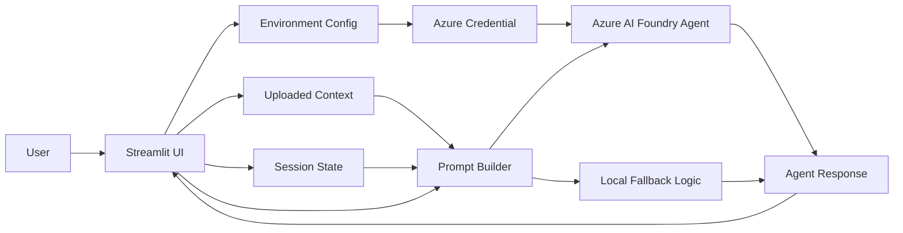
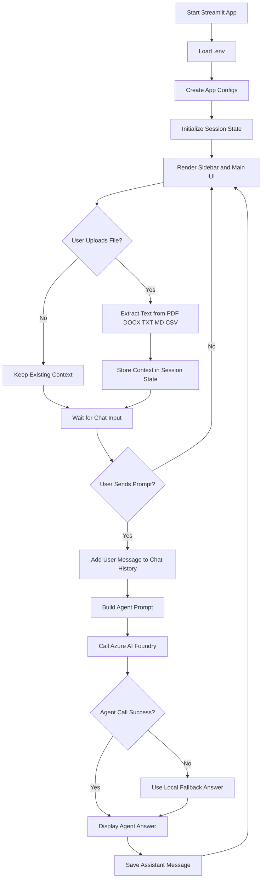
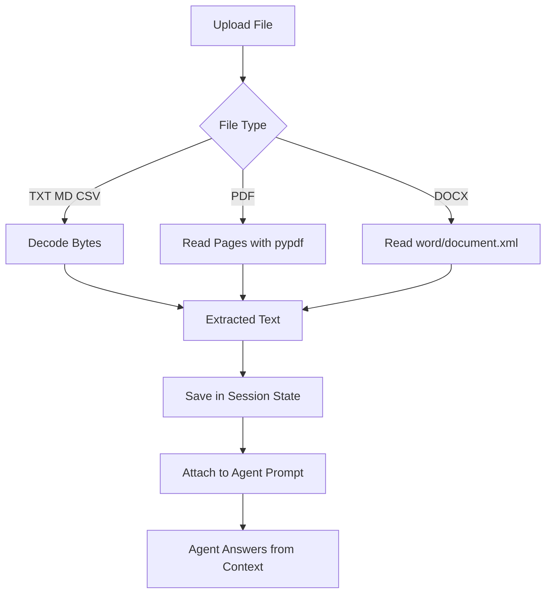
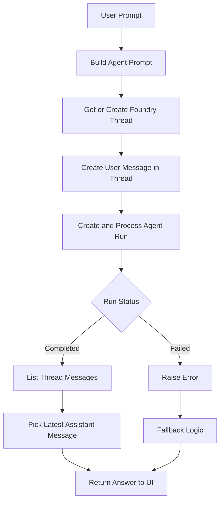
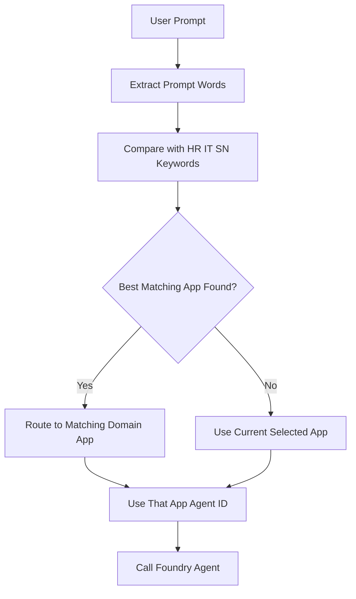
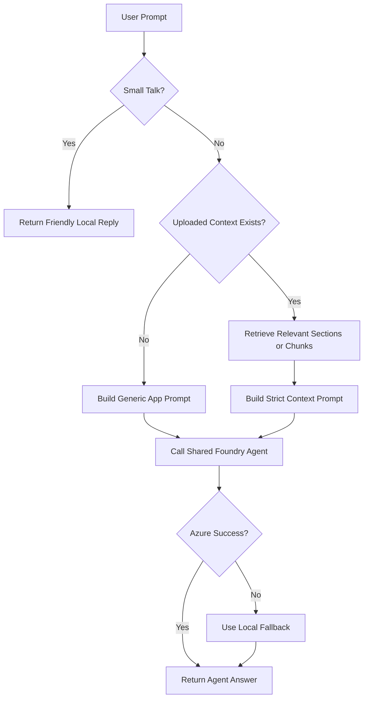
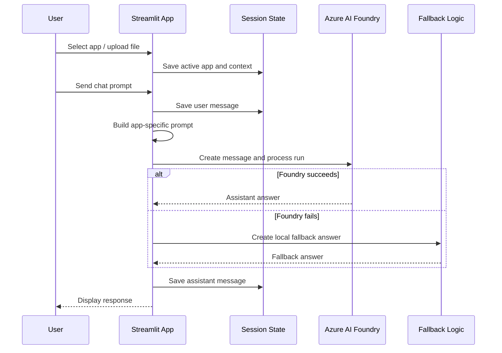

# Application-LOGIC and Agents-LOGIC

This document explains, briefly and practically, how the Streamlit application logic and Azure AI Foundry agent logic work in this project.

The project has two Streamlit app files:

- `app.py`: multi-application portal with HR, IT, and ServiceNow apps, plus auto-routing to domain agent IDs.
- `app2.py`: multi-application portal using one shared Foundry agent, tenant-aware Azure authentication, small-talk detection, and stronger uploaded-document retrieval.

The main user experience is the same in both files: the user selects an app, optionally uploads a document, asks a question, and receives either an Azure AI Foundry response or a local fallback response.

## 1. High-Level Block Diagram



## 2. Application-LOGIC

Application logic means everything the Streamlit app does before and after the AI agent is called.

### Step-by-Step Application Flow

1. Load environment variables from `.env`.
2. Define application settings in `APP_CONFIGS`.
3. Start Streamlit and apply EY-style UI CSS.
4. Initialize `st.session_state` for:
   - active app
   - chat messages
   - uploaded document text
   - uploaded document file names
   - Foundry thread IDs
5. Show sidebar controls:
   - application selector
   - agent details
   - project endpoint
   - deployment/model details
   - file uploader
   - clear chat button
6. Render the main portal header and active app panel.
7. Show quick prompt buttons for common HR, IT, and ServiceNow tasks.
8. Display chat history for the active app.
9. Read user input from `st.chat_input`.
10. Build the correct prompt for the selected app.
11. Call Azure AI Foundry agent.
12. If Azure fails, use local fallback logic.
13. Save assistant response back into session state.

### Application Flowchart



## 3. App Modes

The portal supports three domain applications.

| App | Purpose | Typical Questions |
| --- | --- | --- |
| HR App | Employee support and HR process guidance | Leave, onboarding, benefits, payroll, policies |
| IT Helpdesk App | Technical support and access help | Laptop, VPN, password, MFA, software, email |
| ServiceNow Ticketing App | Ticket drafting and ITSM notes | Incidents, priority, assignment notes, resolution notes |

Each app has its own:

- title and caption
- chat placeholder
- initial assistant message
- uploaded document context
- chat history
- quick prompts
- fallback responses

## 4. Uploaded Document Logic

The user can upload documents for app-specific context.

Supported file types:

- `.pdf`
- `.docx`
- `.txt`
- `.md`
- `.csv`

### Document Processing Steps

1. User uploads a file in the sidebar.
2. App checks file extension.
3. App extracts text:
   - text-like files are decoded directly
   - PDF files are read with `pypdf`
   - DOCX files are read from `word/document.xml`
4. Extracted text is saved in `st.session_state.app_contexts`.
5. If the uploaded file changed, the previous Foundry thread for that app is cleared.
6. The document text is added to the agent prompt when relevant.

### Document Context Flow



## 5. Agents-LOGIC

Agent logic means how the app decides what instructions and context are sent to Azure AI Foundry, how the Foundry thread is managed, and how responses are returned.

### Agent Call Steps

1. Build app-specific instructions from `APP_CONFIGS`.
2. Add uploaded document context if available.
3. Add the selected application name.
4. Add the user's latest request.
5. Get or create a Foundry thread ID for the active app.
6. Create a user message in the Foundry thread.
7. Run the configured Foundry agent.
8. Read assistant messages from the thread.
9. Return the latest assistant message to the Streamlit UI.

### Agent Flowchart



## 6. Difference Between `app.py` and `app2.py`

### `app.py`

`app.py` is designed for domain-agent routing.

Important functions:

- `route_app()`: scores the user prompt against HR, IT, and ServiceNow keywords.
- `build_agent_prompt()`: combines app instructions, uploaded context, and user question.
- `ask_foundry_agent()`: sends the prompt to Azure AI Foundry and returns the answer.
- `fallback_answer()`: gives local guidance if Azure is not available.

Routing behavior:



### `app2.py`

`app2.py` is designed for one shared Foundry agent with stronger local control.

Important functions:

- `build_azure_credential()`: chooses tenant-aware Azure authentication.
- `is_small_talk()`: detects greetings and avoids unnecessary Azure calls.
- `retrieve_relevant_context()`: finds useful uploaded document chunks.
- `uploaded_context_answer()`: answers from uploaded context when possible.
- `build_agent_prompt()`: gives strict rules to avoid inventing policy/SOP details.
- `ask_foundry_agent()`: runs the Azure AI Foundry agent.

Small-talk and context behavior:



## 7. Prompt Construction Logic

The prompt sent to the agent contains four main parts.

```text
1. System-style app instructions
2. Uploaded document context, if available
3. Active application name
4. User request
```

Example structure:

```text
You are a precise enterprise assistant.
Follow the application rules.

Application-specific instruction:
HR / IT / ServiceNow behavior

Uploaded document context:
Relevant extracted text

Application:
HR App

User request:
Explain the leave policy
```

## 8. Fallback Logic

Fallback logic keeps the app useful even if Azure authentication, permissions, network, or Foundry run execution fails.

Fallback can happen when:

- Azure login is missing or expired.
- Tenant or RBAC permission is incorrect.
- Foundry agent run fails.
- No assistant message is returned.
- Local machine cannot reach the Foundry project.

Fallback response types:

- HR: leave, onboarding, benefits, HR email draft.
- IT: VPN, password/account lockout, software/access request.
- ServiceNow: ticket draft, classification, resolution note.
- Uploaded document: matching excerpts from uploaded context.

## 9. Complete Runtime Sequence



## 10. Simple Mental Model

Think of the project in three layers:

```text
UI Layer
  Streamlit screens, sidebar, file upload, chat display

Application Layer
  App selection, session state, document extraction, routing, fallback

Agent Layer
  Prompt building, Azure credential, Foundry thread, agent run, assistant response
```

In short:

- Streamlit manages the user experience.
- `APP_CONFIGS` defines the three app personalities.
- Session state remembers each app's chat and document context.
- Uploaded files provide extra source material.
- Azure AI Foundry generates the main response.
- Local fallback logic protects the demo when the cloud agent is unavailable.

